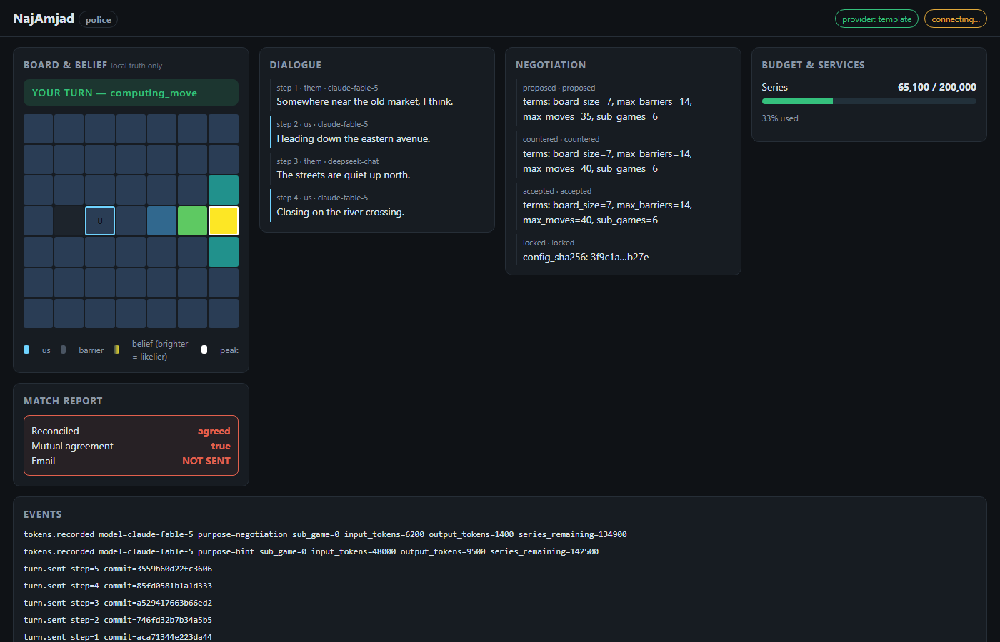
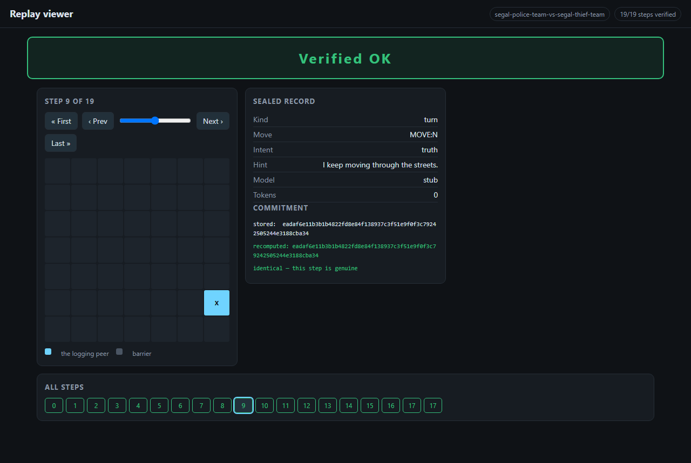
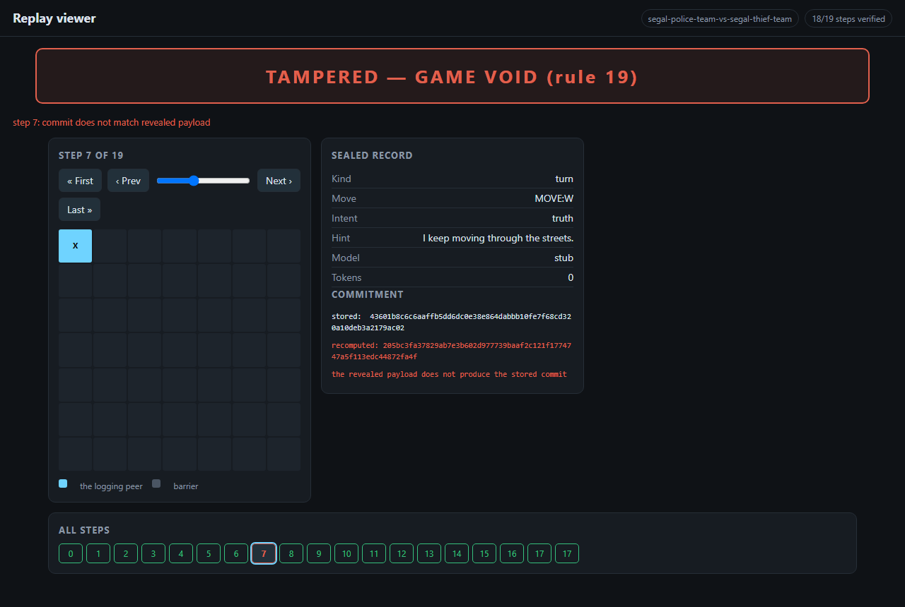
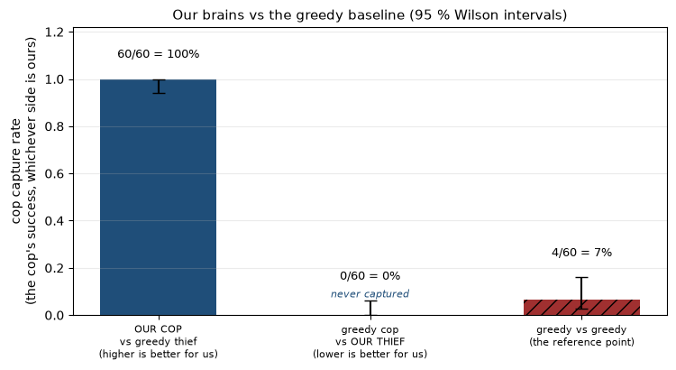
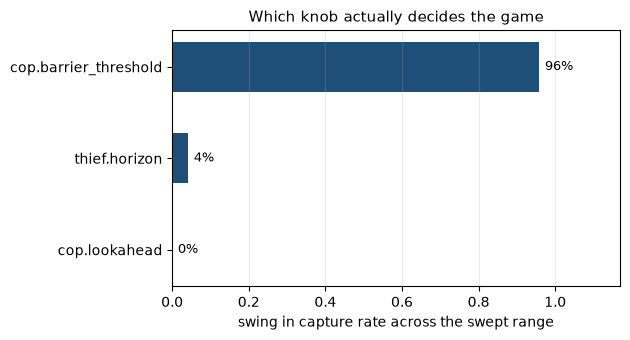

# NajAmjad — Thief Agent 🥷

The **thief side** of Team NajAmjad's final project for *Orchestration of AI Agents*:
a distributed cops-and-thieves game played peer-to-peer over MCP (FastMCP/HTTP) against other
teams' agents, with SHA-256 commit-reveal integrity and Gmail-API result reporting.

> **Companion repository (cop agent):** https://github.com/najikay/najamjad-thief
> The shared core package is byte-identical across both repos, enforced by
> `scripts/sync_core.py` in CI (see `docs/PLAN.md`, ADR-002).

[](https://github.com/najikay/najamjad-thief/actions/workflows/ci.yml)

**Team:** Naji Kayal · Amjad Abed — group `najamjad`
**Status:** M6 — **six counted series played and filed** against six distinct opponents,
rule 31's pass threshold met three times over. Plays a full audited series, interoperates
with the course reference simulator and with six independent team implementations, and
audits an opponent's play after the match. Remaining work is tracked in `docs/TODO.md`.

### League record

| # | Date | Opponent | Result | Us | Them |
|---|---|---|---|---|---|
| 1 | 2026-08-08 | `uoh-ay26` | **won** 6–0 | 90 | 30 |
| 2 | 2026-08-13 | `imreeyal` | **won** 6–0 | 90 | 30 |
| 3 | 2026-08-14 | `vibecode` | lost 0–6 | 30 | 90 |
| 4 | 2026-08-17 | `MOAAMOHA` | **won** 4–2 | 60 | 40 |
| 5 | 2026-08-18 | `nis-yar1` | lost 0–6 | 30 | 90 |
| 6 | 2026-08-21 | `ahk-yosi` | **tied** 3–3 | 75 | 75 |

**Thirty-six of thirty-six mini-games verified `Verified OK` at the audit, across six
counted series, with zero technical losses attributable to us.** That is the number we would point
at first: every game we played was one both sides could re-hash and agree on, including the
two we lost badly.

Two series reconciled field for field against the opponent's own filed report — vibecode's
at 66 fields with zero differences, and a later friendly against `anrbj666` matching on all
six sub-games, both `mutual_agreement.sha256` values, and both per-window `github_commit`
pairs. A report that agrees with the opponent's is the only kind that cannot be voided under
rules 33-35, and it is worth more to us than a scoreline.

---

## Contents

- [Installation](#installation) · [Command line](#command-line) · [Running it](#running-it) · [Match-day workflow](#match-day-workflow)
- [Configuration](#configuration) · [The dashboard](#the-dashboard) · [Replay viewer](#replay-viewer)
- [Academic report](#academic-report): [the model](#the-model-a-dec-pomdp-neither-side-can-see) ·
  [orchestration dilemmas](#orchestration-dilemmas) · [strategies](#strategies-and-why-not-rl) ·
  [what testing against a stranger taught us](#what-testing-against-a-stranger-taught-us)
- [Documentation index](#documentation) · [License & attribution](#license--attribution)

---

## Installation

**Requirements**

| | |
|---|---|
| Python | 3.12+ (managed by uv — you do not need it pre-installed) |
| [uv](https://docs.astral.sh/uv/) | the only package manager used here (guidelines §8.4) |
| OS | Linux, macOS, or Windows via WSL2 — developed on WSL2 |
| Optional | `cloudflared` for a public tunnel; a Google Cloud project for report email |

```bash
git clone https://github.com/najikay/najamjad-thief.git
cd najamjad-thief
uv sync                       # installs the locked dependency set
uv run python scripts/check_all.py   # every CI gate, one PASS/FAIL verdict
```

`check_all.py` passing means the install is sound: lint, file-size limits, repo
rules, type checking and the full test suite.

**Secrets** — copy `.env-example` to `.env` and fill in real values. Nothing secret is ever
committed; `.gitignore` covers `.env`, `secrets/`, `token.json` and `credentials.json`, and a
CI gate fails the build if one is ever tracked (book rules 39-40).

```bash
cp .env-example .env          # then edit: ANTHROPIC_API_KEY, DEEPSEEK_API_KEY, …
```

**Troubleshooting**

| Symptom | Cause and fix |
|---|---|
| `port 8801 … already in use` | Another agent is running. Stop it, or change `network.my_port` in `config/thief/game.toml`. |
| `peer` takes ~15 s to answer | Normal: importing the MCP stack. It prints `Uvicorn running` when genuinely ready — start well before a match. |
| Opponent reports us unreachable | Check the tunnel: `uv run najamjad-thief preflight`. A `502` means the agent is not running; a JSON-RPC error such as *"Client must accept text/event-stream"* means it **is** healthy — that is a browser hitting an MCP endpoint. |
| `Failed to spawn: najamjad-thief` | Run from the repository root; the console script lives in this repo's `.venv`. |
| OAuth browser never opens (WSL) | Expected — WSL has no default browser. Use `uv run python scripts/authorise_gmail.py --manual` and paste the URL yourself. |
| Everything is slow on `/mnt/c` | Windows-mounted filesystems are slow in WSL. The event log holds its handle open for exactly this reason; if you can, keep the workspace on the Linux filesystem. |

---

## Command line

One console script per repo (`najamjad-thief` here, `najamjad-cop` in the companion). Every
verb is argument parsing plus a single SDK call — the CLI holds no game logic, and a
meta-test keeps it that way.

```bash
uv run najamjad-thief --help                     # every verb
uv run najamjad-thief version                    # code version (book rule 53)

uv run najamjad-thief preflight                  # match-day checklist
uv run najamjad-thief peer                       # serve: MCP server + tunnel + dashboard
uv run najamjad-thief match                      # serve, then play the agreed series
uv run najamjad-thief peer --no-tunnel --no-dashboard   # local play, nothing exposed

# Re-hash every step of a log and print the verdict. Paths are literal —
# `<log>` would be read by the shell as a redirect, so use a real one:
uv run najamjad-thief replay tests/goldens/artifacts/log_segal-police-team-vs-segal-thief-team_g01.json
uv run najamjad-thief replay path/to/log.json --serve   # open the viewer instead
uv run najamjad-thief archive match.zip                 # bundle evidence (secrets excluded)
```

**Exit codes**, because these run in scripts:

| Code | Meaning | Example |
|---|---|---|
| `0` | it worked | preflight ready, log verified |
| `1` | it ran, the answer was bad | not match-ready, log **TAMPERED** |
| `2` | it could not run | log file missing or unreadable |

A tampered log and a missing file are deliberately different codes: an audit result must
never be mistaken for a typo.

**Development commands**

```bash
uv run python scripts/check_all.py                  # all CI gates, one verdict
uv run python scripts/self_play.py --games 100      # measure our brains vs baselines
uv run python scripts/demo_dashboard.py             # dashboard over a played game
uv run python scripts/two_process_match.py          # both repos as real processes
uv run python scripts/sync_core.py ../najamjad-thief   # verify the mirrored core
```

---

## Running it

Everything below works from a fresh clone with no opponent and no API keys. The
agent plays a full audited series on templates alone (book PAGE 67) — the LLM is
an enhancement, not a dependency.

### 1. Install and prove the install

```bash
git clone https://github.com/najikay/najamjad-thief.git
cd najamjad-thief
uv sync                                     # locked dependency set
uv run python scripts/check_all.py          # every CI gate, one verdict
```

`ALL GATES PASSED` means lint, file sizes, repo rules, types, the strategy
suite and 1,900+ tests are green.

### 2. Serve as a peer, with the dashboard

```bash
uv run najamjad-thief peer --dashboard --no-tunnel
```

Wait for `Uvicorn running` — that, not the first log line, is readiness. Cold
start is ~15 s (importing the MCP stack), so start early on match day.

Then open **http://127.0.0.1:8000/**.

The port and host come from `config/setup.json` (`ui.port`, `ui.host`). It binds
to loopback by design: the dashboard shows *our* belief and *our* sealed state,
so exposing it would hand an opponent everything commit-reveal exists to hide
(rules 8-9).

**What you get:**

| Panel | Shows |
|---|---|
| Board | Belief heatmap on a log scale — linear collapsed 47 of 48 cells into one band |
| Turn banner | Whose move, which step, which phase |
| Dialogue | Every hint in and out, with the model that wrote it |
| Negotiation | Propose → counter → lock, and terms awaiting a human |
| Budget | Tokens against the agreed 200k cap |
| Match day | Readiness — the same checks `preflight` runs |
| Testing | Practice mode, and whether each endpoint is answering |
| Matches | Every match we have filed: score, per-game audit verdicts, artifacts |
| Events | The raw event stream |

Updates arrive over a WebSocket; the client never polls. A dashboard failure
cannot affect a game — it is a subscriber and nothing more (ADR-005).

**Optional controls.** Set `features.controls` to `true` in `config/setup.json`
to enable start/stop, negotiation approval, and the practice-mode toggle from
the page. Off by default, and there is deliberately **no button that plays a
counted match** — that is graded and irreversible, and `docs/RUNBOOK.md` is the
interface for it.

### 2b. Testing without touching the lecturer

The **Testing** panel answers the two questions that otherwise mean digging
through logs.

*Which mode am I in?* Practice mode redirects every report to your own inbox
instead of the lecturer's, and prefixes the subject `[PRACTICE]`. It does not
skip the send — sending is the step that lost matches in assignment 6, so a
practice run exercises it for real and you read the actual email. The redirect
is enforced twice: the address is rewritten, and then checked at the point of no
return, so a rewrite that silently failed raises instead of delivering. See
[docs/CONFIG.md](docs/CONFIG.md) §3b.

Toggle it from the panel (with `features.controls` on), or set
`practice.enabled` in `config/setup.json`. It is read fresh each time a report
is built, so the switch takes effect without a restart, and it overrides
`email.mode` to `send` — a practice run that quietly produced a draft would
look exactly like a successful send.

*Is anyone actually reachable?* **Probe endpoints** dials our MCP URL and the
opponent's and reports three states, not two:

| State | Meaning |
|---|---|
| green | something accepted a TCP connection there |
| red | configured, but nothing is listening — **this blocks a match** |
| grey | not configured yet — a match not scheduled, not a fault |

A green light means the port answered. It does **not** mean the protocol works
or that they will agree to our terms — that is what the handshake is for, and
the panel deliberately claims no more than it can check.

### 3. Check you are ready to play

```bash
uv run najamjad-thief preflight        # exit 0 or do not play
uv run python scripts/pre_match_smoke.py     # MATCH READY in ~50 s
```

### 4. Play

Put the opponent's URL in `network.opponent_url` (`config/thief/game.toml`),
then:

```bash
uv run najamjad-thief match --dashboard --no-tunnel
```

A finished match writes four artifacts per Appendix F into
`workspace/artifacts/` — declaration, config, log and result — and emails the
result. Check them with:

```bash
uv run python scripts/post_match.py --opponent <name>
```

### 5. Try it without an opponent

Two ways, both real:

```bash
# our cop against our thief, two OS processes over real MCP/HTTP
uv run python scripts/two_process_match.py

# against the course reference simulator (expects ../reference-sim)
uv run python scripts/rehearsal.py --games 6
```

The second is the one that matters — it is the only setup that has ever caught
our interop defects, because it is the only opponent we did not write.

### 6. Verify a log

```bash
uv run najamjad-thief replay workspace/artifacts/log_<game_id>_g01.json
```

Exit `0` is `Verified OK`; exit `1` is `TAMPERED` and names the failing step;
exit `2` means the file could not be read. A tampered log and a typo are
deliberately different codes — an audit verdict must never be mistaken for a
mistyped path.

Add `--serve` to open the viewer instead of printing a verdict.

### 7. Measure

```bash
uv run python scripts/strategy_smoke.py --games 50   # win rates with intervals
uv run python scripts/sweep.py --games 24            # parameter sensitivity
uv run python scripts/measure_tokens.py              # token census
```

Results land in `results/` and are what `notebooks/analysis.ipynb` plots.

## Match-day workflow

The full procedure with exact commands is `docs/RUNBOOK.md`. In outline:

1. **Warm up** — start the agent early; cold start is ~15 s.
2. **Preflight** — `uv run najamjad-thief preflight`; exit 0 or do not play.
3. **Exchange URLs** — set `network.opponent_url` in `config/thief/game.toml`.
4. **Play** — `uv run najamjad-thief match`, dashboard on http://127.0.0.1:8000/.
5. **Audit** — automatic per mini-game; every game must read `Verified OK`.
6. **Report** — reconcile with the opponent, then send (rule 30: `gmail.send` only).
7. **Archive** — `uv run najamjad-thief archive match.zip` (secrets excluded).

---

## Configuration

| File | Role |
|---|---|
| `config/game.json` | **Shared, signed terms.** Both peers must hold a byte-identical copy; the handshake refuses to play on any mismatch. Ours is the opening proposal — every value at or above the Appendix F minimum (rule 12: raise, never lower). |
| `config/thief/game.toml` | **Private, local.** Our port, opponent URL, tunnel hostname, LLM choices, belief tuning. Never crosses the network. |
| `config/rate_limits.json` | Per-service limiter settings, validated against the Appendix F ceilings at load. |
| `.env` | Secrets only. Never committed. |

Parameters worth knowing:

| Key | Effect |
|---|---|
| `network.my_port` | Our MCP port (8801 thief / 8802 cop, so both run locally). |
| `network.opponent_url` | The only thing we know about the opponent. Preflight fails while empty. |
| `tunnel.hostname` | Permanent public name. A *named* tunnel keeps its URL across restarts — the defect that cost Assignment 6 the most time (ADR-004). |
| `llm.every_n_steps` | Hint cadence. A quality dial, not a savings dial — see `docs/TOKEN_BUDGET.md`. |
| `belief.smell_trust_weight` | How far we trust scent against a possibly-lying hint. |
| `movement_and_barriers.*` | Agreed rules. Changing these unilaterally breaks the signature. |

---

## The dashboard

Belief heatmap, turn banner, dialogue with per-message model provenance, the negotiation
timeline, token budget, and report delivery status — pushed over a WebSocket, never polled.
It shows **local truth only** (book rules 8-9): the opponent's position has no field in the
read model, and a meta-test enforces that the UI can reach the agent only through the SDK.



## Replay viewer

Every step is re-hashed from its revealed `(payload, nonce)` and compared with the stored
commitment (book rule 20). Below, the lecturer's own sample log replaying clean:



And the same log with one record edited after the fact — the forgery is localised to exactly
the step it was planted in, and rule 19 voids the game:



See `assets/README.md` for how each image is reproduced.

---

## Academic report

### The model: a Dec-POMDP neither side can see

The game is a **decentralised, partially observable Markov decision process**. Neither agent
observes the true state: positions are sealed inside commitments until the end-of-game audit,
so each peer holds a *belief* over where the other might be and acts on that.

Two observation channels, with opposite trust properties:

- **Scent** — a decaying pheromone trail the opponent emits involuntarily and *cannot fake*
  (book PAGE 22). Unfakeable but blurry.

  **Two models ship, and either can be selected per match.** The book (PAGE 43-44) is
  radial — 0.90 / 0.62 / 0.42 / 0.20 / 0.14 / 0.04 — with relative decay `τ ← (1-ρ)·τ`;
  the reference simulator is linear in Chebyshev distance — rings 0.90 / 0.60 / 0.30 —
  with absolute decay `τ ← τ - ρ`. We implement both, and both are registered in the
  interop kit: `ScentModel.BOOK` is `multiplicative_book_v1` (`934c220d…`) and
  `ScentModel.REFERENCE` is `subtractive_chebyshev_v1` (`81ebee59…`). Each reproduces the
  kit's own published vectors, so matching an opponent is one key —
  `pheromones.pheromone_model` in `config/game.json` — and **not** a change to the fourteen
  signed terms, so the contract digest `a284082d…` survives the switch and nobody has to
  re-sign. The digest we declare at negotiate is looked up *from* the configured model, so
  there is no state in which we emit one physics and claim another. Emission is separately
  dialled from hints — `--scent full|window|none` and `--hints/--no-hints` — so a fully
  silent series is one flag; under silence we declare no model at all, because a claim about
  a field nobody is sending is not a claim worth making.
- **Hints** — free natural language, which the rules explicitly permit to be a lie
  (rules 26-27). Precise but untrustworthy.

Our belief engine fuses them: diffusion for movement, a scent-likelihood update, and a
credibility weight per opponent that rises and falls as their hints agree or disagree with the
trail. The full derivation is in `docs/PRD_belief_engine.md`.

Three findings from building it, each of which changed the design:

- **Scent decay had a fixed point.** Relative decay rounded to three decimals never reached
  zero, so dead trails polluted belief forever. Fixed with an explicit epsilon.
- **Multiplicative fusion double-counted** the cumulative scent field and left belief lagging a
  moving opponent by ~5 cells. Replaced with a robust mixture update.
- **A flat likelihood parked belief mid-trail.** Sharpening plus an *additive* floor fixed it;
  a clamp made faint scent indistinguishable from none.

### Orchestration dilemmas

**One gateway, or many callers?** Book rule 3 mandates an orchestrator, and we took it
literally: peripheral modules never call each other. The belief engine knows nothing of the
transport, strategy knows nothing of crypto, the transport knows nothing of the rules. That is
what makes the whole turn loop testable against fakes — the seam Assignment 6 never had.

**How much to trust a fake.** Our sharpest lesson. Three separate defects survived 1,500
passing tests because the fakes were *kinder than the wire*: a fake transport that wrapped an
audit payload the real one did not, an in-memory link that never blocked, and peers that only
ever played themselves. Interop can only be tested against something you did not write.

**Where to put the deadline.** A peer that answers forever must not hold us in a decided game,
and a peer that goes quiet must not become our technical loss. Every wait is bounded and every
ending is *announced* rather than assumed — see below.

**Rate limiting our own protocol.** The gatekeeper exists to be a good citizen towards
Anthropic and Gmail. Applying it to the opponent nearly cost us games: our own limiter could
have delayed a reply past their 30-second deadline.

### Strategies, and why not RL

**Cop** — belief-directed pursuit with lookahead diffusion, plus barrier placement scored by
how much freedom it denies the *likely* thief cells rather than by raw distance. Standing next
to a cell you cannot enter is worth nothing.

**Thief** — survival-horizon evasion, not greedy distance maximisation. The greedy move often
walks into a corner that is one barrier from a capture; we search the horizon for cells that
keep escape routes open.

**Hint policy** — bluffing is a strategic resource with a cost: a claim discloses the claimer's
cell, so a false capture claim hands the thief our exact position for nothing.

**No reinforcement learning**, deliberately:

- Only ~60 real games are available across the whole league — nowhere near enough to learn a
  policy over a state space this size.
- Opponent behaviour is non-stationary; every team ships something different.
- Non-determinism would break replay, and replay is a graded deliverable.
- The heuristics already beat the baseline decisively (below), so RL would be risk without
  measured upside.

Instead we do **online opponent modelling** sized to the ~210 observations a series actually
provides — hint credibility, move tendencies, barrier response.

**Measured** through the real match machinery on **held-out games** — seed 11,
never used while tuning, 60 games per matchup:

| matchup | captures | rate | 95 % Wilson CI |
|---|---|---|---|
| greedy cop vs our thief | 0/60 | **0 %** (100 % survival) | 0–6 % |
| our cop vs greedy thief | 60/60 | **100 %** | 94–100 % |
| greedy vs greedy (reference) | 4/60 | 6.7 % | 2.6–16 % |

Zero peer disagreements and zero audit failures across all 180 games.



**The caveat this repository is obliged to state.** Our thief's 100 % survival
is measured against the *greedy* cop. Against our own cop it survives about 4 %
of games, and sweeping `thief.horizon` across 1–5 does not move it — every value
is caught in 23 or 24 of 24 games, differences well inside the confidence
intervals. So this is not a tuning problem, and the headline number is a
statement about the opponent rather than about the evader. An opponent whose cop
is as good as ours should be expected to catch our thief. It is recorded as the
project's largest competitive risk in `docs/OPEN_ITEMS.md`.

For the cop side, one tunable decides the match:



`barrier_threshold` swings the capture rate from **4 % to 100 %** across its
range, because a barrier is impassable for *both* sides — a cop that walls on
weak evidence fences itself away from the thief it is chasing.

Full derivations, confidence intervals, the token-cost table and the references
are in **`notebooks/analysis.ipynb`**. Reproduce with:

```bash
uv run python scripts/baselines.py --games 60 --seed 11   # held-out comparison
uv run python scripts/sweep.py --games 24 --seed 7        # sensitivity sweeps
uv run python scripts/measure_tokens.py                   # token census
```

### What testing against a stranger taught us

We cloned the course reference simulator and pointed it at us. **Nothing worked, in either
direction.** The reference names the MCP tool argument `message` on three tools and `payload`
on one; we sent `payload` to all four and accepted only `payload`. Every turn and every
proposal was rejected by argument binding *before a single byte of game logic ran* — against
any agent built on the reference, which is most of the class.

Four more incompatibilities followed: a required `timestamp` we never sent, a `claimed_cell`
field their parser rejects outright, and three claim fields whose types differed. Then the
audit reveal turned out to be sent as a bare list where the schema declares an envelope, so
both peers recorded **TAMPERED** for games nobody had cheated in.

Every one of those passed our own tests. The commit-reveal core, by contrast, survived contact
unchanged: our `commit_of` reproduces the reference's signature byte for byte.

The lesson we would carry to any distributed project: **a green test suite proves your code
agrees with your assumptions, not that your assumptions are right.**

---

## Documentation

| Document | Purpose |
|---|---|
| `docs/PRD.md` | Product requirements (FR-* ids, KPIs, milestones) |
| `docs/PLAN.md` | Architecture: C4 + FSM diagrams, ADR-001..021, module map |
| `docs/TODO.md` | 688-task build plan with traceability and progress |
| `docs/HANDOFF-2026-08-14.md` | Current state, open items, and every correction measured |
| `docs/PROTOCOL.md` | What crosses the wire, and what never does |
| `docs/SECURITY.md` | Threat model, prompt-injection defences, secret handling |
| `docs/UX.md` | Nielsen heuristics mapped to dashboard decisions; accessibility |
| `docs/EXTENDING.md` | The four extension seams, with a worked plugin |
| `docs/CONFIG.md` | Every config key, its file, and its Appendix F negotiability |
| `docs/CI.md` | What each gate checks and how to reproduce a failure |
| `CONTRIBUTING.md` | Conventions: core sync, commits, tests, match-day freeze |
| `docs/ISO25010.md` | ISO/IEC 25010 quality characteristics mapped to evidence |
| `docs/edge-cases.md` | Every handled boundary condition, each linking its test |
| `docs/TOKEN_BUDGET.md` | Measured token consumption and the cost model |
| `docs/OPEN_ITEMS.md` | What is known to be incomplete, with the evidence |
| `notebooks/analysis.ipynb` | Sensitivity studies, baselines, cost table, references |
| `docs/PRD_belief_engine.md` · `PRD_commit_reveal.md` · `PRD_llm_router.md` | Mechanism designs |
| `docs/runbook-network.md` | Tunnel and connectivity procedures |
| `docs/research/` | Source digests (book, guidelines, reference simulator, A6 retrospective) |

---

## Auditing an opponent

Commit-reveal proves a peer did not *rewrite* history. It proves nothing about whether they
played by the rules, and those are different guarantees — we conflated them for the whole
league phase and could not say, after losing a series, whether the play had been legal.

Auditing is **post-match by design**: rules 33-35 void a match for contradictory reports, so
an agent acting on its own accusation converts a suspicion into a mutual zero. Everything
below records evidence and changes nothing about how we play (PLAN ADR-019).

```bash
# replay their revealed records through the fair-play rules: movement legality,
# the Barrier Law, the budget, step order, hint length — and say what it could NOT check
uv run python scripts/audit_opponent.py --team vibecode

# are we disclosing scent on the same terms they are?
uv run python scripts/scent_parity.py --since 2026-08-14T16:00   # UTC

# 323 of 323 sealed capture claims name the claimer's own revealed cell
uv run python scripts/claim_evidence.py

# both repos must declare the same counted-match count (rules 37-38)
uv run python scripts/reconcile_counted.py ../najamjad-thief --apply
```

What a reveal can settle and what only the wire can: a peer's sealed record holds what that
peer chose to seal. Movement and barriers are checkable from an archive alone; `smell_grid`,
`capture_claim`, `hint` and response times are checkable only against what arrived on the
wire, which is why `FrameLog` keeps them as sent. The audit reports those as *not checkable*
rather than folding them into a clean verdict — "we looked and agreed" and "there was nothing
to look at" must never read the same.

## Two results that constrain every strategy

Both were established by measurement during the league phase, and both are load-bearing.

**A barrier can shrink the board but can never take the thief.** The book gives three capture
conditions (rules 46-47); the course reference implements exactly one. Its `rules.py` has
`thief_result` and `is_captured` and no barrier-capture or immobilisation check anywhere.
Every opponent we have met is reference-derived, so enclosure yields a mini-game *we* score
and *they* do not — the rules 33-35 contradiction. **Every capture must be a claim the thief
confirms** (PLAN ADR-020).

**One cop cannot close on an open board.** A 7×7 grid is the Cartesian product of two paths,
so its cop number is 2 (Maamoun & Meyniel 1987), and an exhaustive fixed-point over all 49×49
states finds *no* state from which a movement-only cop can force a capture under simultaneous
moves. Our cop tracking a thief to distance 2 and holding there for 28 steps is a theorem,
not a defect. Barriers are the only resource that changes the answer (PLAN ADR-021).

`tests/regression/cop_duel.py` is the cop-side benchmark those claims are tested with — our
cop against an adaptive thief, with the belief the real ingress path builds from scent. A
*recorded* opponent line does not react and cannot measure closing.

---

## License & attribution

MIT (see `LICENSE`). Protocol shapes and artifact schemas interoperate with the course
reference simulator [`rmisegal/Game-P2P-Cop-Chase`](https://github.com/rmisegal/Game-P2P-Cop-Chase)
(educational license); where book and code conflict, the book governs.

Built with [FastMCP](https://github.com/jlowin/fastmcp), [FastAPI](https://fastapi.tiangolo.com/),
[pydantic](https://docs.pydantic.dev/), and [uv](https://docs.astral.sh/uv/).
