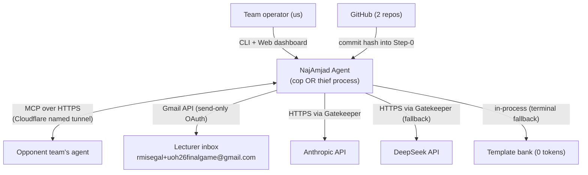
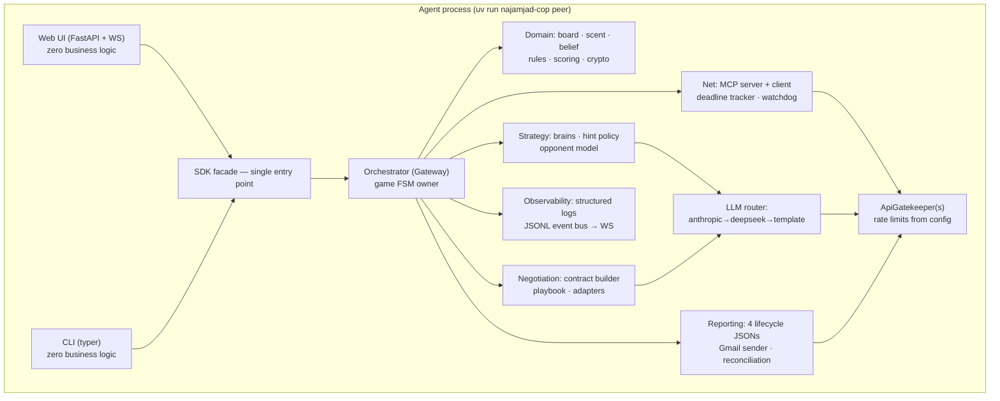
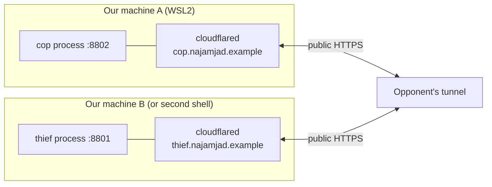
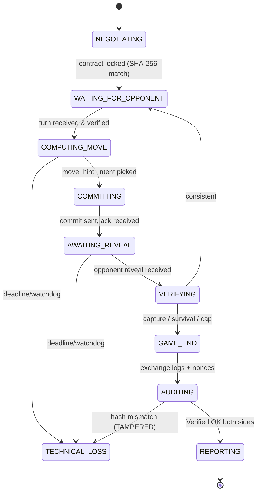
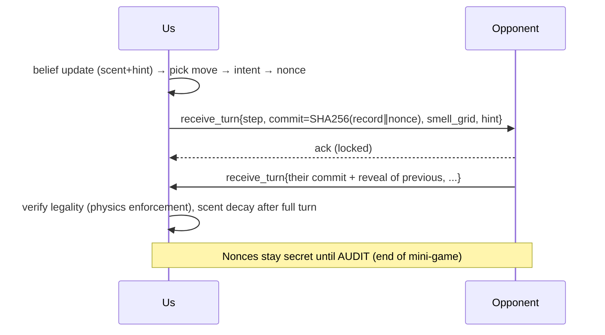

# PLAN — Architecture & Technical Plan (Team NajAmjad)

| | |
|---|---|
| **Document version** | 1.00 |
| **Date** | 2026-07-24 |
| **Companion docs** | `docs/PRD.md` (requirements), `docs/TODO.md` (tasks), `docs/research/*` (digests) |
| **Deliverable repos** | `najamjad-cop` (police agent) · `najamjad-thief` (thief agent) |

---

## 1. Architecture overview

### 1.1 C4 Level 1 — System context



Two independent deployments of the same architecture: the cop process (from `najamjad-cop`) and
the thief process (from `najamjad-thief`). They never share memory, files, or config dirs
(book rules 1–2). During self-play testing, both run locally against each other over MCP.

### 1.2 C4 Level 2 — Containers (one agent process)



Orchestrator pattern is book-mandated (rule 3): peripheral modules never call each other
directly; the Orchestrator is the single conductor. SDK-facade and Gatekeeper are
guidelines-mandated.

### 1.3 C4 Level 3 — Component/package map with file-size budgets

Design budget: **≤ 120 code lines per file** (hard course cap 150). Every planned file below
carries a budget; CI fails at > 150, warns at > 120.

```
src/najamjad_agent/
├── __init__.py                      # __version__, __all__
├── constants.py                     # enums: Move, Role, Phase, Intent, EndReason
├── sdk/
│   ├── sdk.py                       # AgentSdk facade (delegation only)          ~100
│   └── queries.py                   # read-model queries for UI/CLI              ~90
├── domain/
│   ├── board.py                     # grid, cells, legality, barriers            ~110
│   ├── movement.py                  # move application, validation (both sides)  ~90
│   ├── scent.py                     # emission field, decay, clamping            ~90
│   ├── belief.py                    # Bayes grid update (scent x movement)       ~110
│   ├── hint_evidence.py             # hint→likelihood, credibility coefficient   ~100
│   ├── scoring.py                   # fixed score table, series accounting       ~80
│   ├── capture.py                   # capture claims, immobilization, truth duty ~90
│   ├── crypto.py                    # commit-reveal, nonce, canonical JSON       ~110
│   ├── audit.py                     # mutual audit, verdicts                     ~100
│   ├── fsm.py                       # game state machine + legal transitions     ~110
│   └── orchestrator.py              # gateway conductor over all subsystems      ~120
├── strategy/
│   ├── base.py                      # BrainBase-compatible interfaces            ~70
│   ├── cop_brain.py                 # expectimax + interception                  ~120
│   ├── cop_barriers.py              # barrier planner (herding/cutting/capture)  ~110
│   ├── thief_brain.py               # survival-horizon evasion                   ~120
│   ├── thief_escape.py              # escape-route counting, scent-aware paths   ~100
│   ├── hint_policy.py               # truth/lie scheduler, plausibility gate     ~110
│   └── opponent_model.py            # per-opponent stats & credibility           ~100
├── negotiation/
│   ├── contract.py                  # game.json builder, canonicalize, SHA-256   ~110
│   ├── playbook.py                  # parameter proposals, red lines             ~100
│   ├── flow.py                      # negotiate FSM: propose/counter/lock        ~120
│   └── adapters.py                  # per-opponent quirk profiles                ~90
├── llm/
│   ├── router.py                    # provider chain, health, degradation        ~110
│   ├── anthropic_provider.py        # Claude client (via gatekeeper)             ~90
│   ├── deepseek_provider.py         # OpenAI-compatible client                   ~90
│   ├── template_provider.py         # sentence banks + landmark vocab            ~100
│   ├── prompts.py                   # prompt builders (hint, parse, negotiate)   ~110
│   ├── hint_guard.py                # word-limit / no-coordinates egress gate    ~80
│   └── token_meter.py               # per-call/game/series metering, budget stop ~90
├── net/
│   ├── mcp_server.py                # FastMCP tools (negotiate/turn/audit/ctrl)  ~120
│   ├── mcp_client.py                # persistent client, retries                 ~100
│   ├── inbox.py                     # queues, ingress schema validation          ~100
│   ├── deadline.py                  # deadline tracker                           ~80
│   ├── watchdog.py                  # heartbeat, persist+shutdown                ~80
│   └── tunnel.py                    # cloudflared supervision, self-check        ~90
├── protocol/
│   ├── schemas_wire.py              # pydantic: turn/negotiate/audit messages    ~120
│   ├── schemas_artifacts.py         # pydantic: 4 lifecycle JSONs                ~120
│   ├── schemas_report.py            # result email payload (strict bools)        ~90
│   └── canonical.py                 # canonical JSON serialization               ~60
├── reporting/
│   ├── artifacts.py                 # write declaration/config/log/result        ~110
│   ├── gmail_sender.py              # OAuth send-only, attachment, confirm id    ~110
│   ├── reconcile.py                 # result diff with opponent pre-send         ~90
│   └── step_zero.py                 # hardware/LLM/commit declaration            ~90
├── shared/
│   ├── config.py                    # TOML+JSON overlay, version validation      ~110
│   ├── gatekeeper.py                # ApiGatekeeper (FIFO, backpressure, drain)  ~120
│   ├── rate_limits.py               # RateLimitConfig loader                     ~60
│   ├── events.py                    # event bus (JSONL + WS fanout)              ~100
│   ├── logging_setup.py             # dictConfig actually applied                ~70
│   ├── sysinfo.py                   # hardware spec collection                   ~80
│   └── version.py                   # 1.00                                       ~10
├── ui/
│   ├── app.py                       # FastAPI app, WS endpoint (no logic)        ~110
│   ├── views.py                     # route handlers → SDK queries               ~100
│   └── static/                      # single-page dashboard (html/js/css)
├── replay/
│   ├── verifier.py                  # per-step SHA-256 recompute                 ~90
│   └── app.py                       # replay UI (Verified OK / TAMPERED)         ~110
└── cli.py                           # typer: peer/preflight/replay/archive       ~110
```

Same tree in both repos; the packages differ in: brain modules included, default configs
(`config/police/` vs `config/thief/`), README, and role-specific docs. See ADR-002.

### 1.4 Deployment diagram



---

## 2. Key state machines & sequences (UML)

### 2.1 Game FSM (book rules 4–5 — illegal transitions raise)



### 2.2 Turn sequence (commit-reveal, per move)



### 2.3 Match lifecycle

Warm-up (uncounted) → counted-game-count declarations → negotiation → contract lock →
Step-0 (hardware+LLM+commit hash, signed) → 6 mini-games with role swaps → mutual audit per
mini-game → result reconciliation → both teams email `result_<game_id>.json` separately →
archive workspace + commit match config.

---

## 3. Architecture Decision Records

### ADR-001 — MCP/FastMCP transport *(status: imposed)*
Book-mandated, non-replaceable. Interop tool surface mirrors the reference simulator
(`negotiate`, `receive_turn`, `submit_audit`, `receive_control`) because every league team
starts from that repo — maximum compatibility for minimum negotiation cost.

### ADR-002 — Two self-contained repos, mirrored core, no shared runtime *(status: accepted)*
**Context:** submission requires separate cop and thief repos; runtime state sharing
disqualifies. **Decision:** both repos contain the full `najamjad_agent` package; role
differences live in strategy modules and `config/` defaults. A `scripts/core_manifest.py`
checksum manifest + CI job asserts the mirrored core files stay byte-identical across repos
(controlled duplication, not drift). **Alternatives:** shared third package (submission
friction, grader ambiguity), git submodule (fragile for graders), true fork (guaranteed
drift). **Trade-off:** duplication cost accepted for grader-friendly standalone repos.

### ADR-003 — LLM provider chain Anthropic → DeepSeek → template *(status: accepted)*
User requirement. Anthropic for best negotiation/bluff quality; DeepSeek (OpenAI-compatible,
cheap, stable) for testing and as fallback; template bank as terminal 0-token floor (book
default). Health-based degradation and recovery; **active provider always visible** (log
event + UI badge + per-message provenance). LLM never selects moves (book rule 25).

### ADR-004 — Cloudflare named tunnel for public exposure *(status: accepted)*
Permanent hostname fixes A6's URL churn. Requires a domain on a (free) Cloudflare zone —
operator prerequisite. `tunnel.py` supervises cloudflared, and preflight performs a self-call
through the public URL. **Fallback:** ngrok static domain (config switch, no code change).

### ADR-005 — FastAPI + WebSocket dashboard; UI is logic-free *(status: accepted)*
Push-based updates from the event bus (no polling — A6 clunkiness), single-page dashboard;
strictly local-truth rendering (book rules 8–9); all data via SDK queries. Replay viewer as a
second page over the same stack; screenshots for README come from these two pages.

### ADR-006 — pydantic schema gates on every ingress AND egress *(status: accepted)*
All wire messages, lifecycle artifacts, and the result email are validated against strict
models (required booleans non-nullable) — egress failure blocks the send and alerts the
operator. Ingress is tolerant: unknown fields logged and ignored; malformed input → structured
error, never a crash. Directly kills A6 pains #5/#6.

### ADR-007 — Heuristic/expectimax strategy; no RL *(status: accepted)*
RL is explicitly optional and untaught; 19 days favor a strong deterministic policy stack:
Bayesian belief + expectimax with barrier planning (cop) / survival-horizon maximization
(thief) + credibility-managed hint policy. The strategy lab (self-play sweeps) supplies the
guidelines-required sensitivity analysis instead of learning curves.

### ADR-008 — Event-sourced observability *(status: accepted)*
Single append-only JSONL event stream per match (correlation ids: `game_uid`, step) is the
one source of truth consumed by: WS dashboard, structured log files, post-match analysis
notebook, and the archive bundle. `dictConfig` applied at startup (A6: config existed but was
never wired). No silent `except` — enforced by ruff (S110/S112 via extend-select in our own
stricter local profile) and code review.

### ADR-009 — One ApiGatekeeper class, per-service instances *(status: accepted)*
Guidelines require ALL external calls gated; book requires token-bucket + DOS detector for
Gmail. One `ApiGatekeeper` (FIFO queue, config-driven limits, backpressure, drain, full call
logging) instantiated per service: `mcp_peer`, `anthropic`, `deepseek`, `gmail`. Limits in
`config/rate_limits.json` (version 1.00): gmail 30 rpm / 2 concurrent / backoff 5 s / 3
retries / queue 100 (Appendix F minimums).

**Coverage-omit note:** the guidelines' sample coverage config omits `src/main.py` and
`src/**/gui/*`; we deliberately omit **less** (only the entry point and `ui/static` assets) —
our `ui/` route/view code stays covered. Stricter than the sample, documented here for graders.

### ADR-010 — uv + ruff + pytest toolchain, CI as compliance robot *(status: imposed/accepted)*
Guidelines-prescribed ruff config; uv-only. GitHub Actions on both repos run: ruff, pytest
with `--cov` (`fail_under = 85`, team target 90), file-size gate (code lines ≤ 150 hard /
120 warn), secret scan, core-manifest cross-repo check, uv-only grep gate (no pip/python -m).

### ADR-011 — Negotiation playbook + adapter profiles *(status: accepted)*
Negotiables (board size↑, starts, axis, map area, hint word cap, timeouts, token budget) get
a prepared position: default / preferred / red line, encoded in `playbook.py` and rendered to
free-language proposals by the LLM (human-approved before send). Per-opponent quirks
(naming, tolerances, pacing) live in `adapters.py` profiles selected at handshake — adapting
to a new team is configuration, not code (A6 pain #2).

### ADR-012 — Golden-file interop tests against the reference simulator *(status: accepted)*
The simulator's artifacts and sample-run outputs are checked into `tests/goldens/`. CI
validates our schemas parse them and our artifacts round-trip to the same shapes. A weekly
(and pre-match) smoke: full series vs the unmodified reference simulator over localhost — our
definitive interop regression (A6 pain #6).

### ADR-013 — No email *receive* path; agreement lives on MCP *(status: accepted)*
**Context:** Assignment 6's worst failure was the inbound-email flow (silent, unobservable,
OAuth-blocked). **Decision:** we never receive email. The book scopes email to send-only
result reporting (`gmail.send`, rule 30); result *agreement* happens over MCP via the
reconciliation exchange (FR-REP-6) **before** either side emails the lecturer. The entire
failed-inbound-email class from A6 is designed out rather than fixed. **Trade-off:** none —
receiving mail has no role in the book's protocol.

### ADR-014 — Static type checking beyond the guidelines *(status: accepted)*
A6 retrospective lesson 10: no type checker meant integration-seam bugs surfaced in the
field. Guidelines mandate only ruff; we additionally run `pyright` (basic mode) in CI on both
repos as a local, stricter, non-graded gate. Full type hints on all public interfaces.

---

## 4. Interop & negotiation playbook (summary; full doc `docs/PRD_negotiation.md` at build time)

1. **Contact** (out-of-band, e.g. course forum/WhatsApp): exchange public MCP URLs + proposed
   match window; send our one-page "How to play us" README link (lowers opponent friction).
2. **Warm-up game** (uncounted, encouraged by book): verifies interop before anything counts.
3. **Negotiation session** over MCP `negotiate`: playbook-driven proposals in free language;
   every step persisted to the timeline; outcome = canonical `game.json` + SHA-256 exchange +
   pheromone-model lock + counted-game declarations.
4. **Contract freeze**: byte-identical `config_<game_id>_gNN.json` committed to repos.
5. **Play → audit → reconcile → both report** (each side separately, attachment JSON).

Red lines (never accept): lowering any Appendix F minimum; numeric-coordinate hint protocols;
LLM-move exception (we decline — our edge is deterministic strategy); skipping audit.

---

## 5. Testing strategy (TDD, target ≥ 90%)

| Layer | Approach |
|---|---|
| Domain (board/scent/belief/crypto/scoring/fsm) | Pure unit tests + **hypothesis property tests** (e.g., commit-reveal round-trip ∀ records; scent decay invariants: clamp bounds, monotone decay; FSM: illegal transitions always raise) |
| Protocol schemas | Golden files from reference simulator (`tests/goldens/`); negative tests (nulls where booleans required must fail egress) |
| Strategy | Deterministic scenario tests (seeded); regression suites of tactical positions ("cop must cut corridor here"); self-play statistical gates (win-rate vs reference brain ≥ 70% over 100 seeded games — nightly job, not PR-blocking) |
| Net/MCP | In-process FastMCP client-server tests; fault injection: timeouts, malformed payloads, dropped connections, out-of-order turns |
| LLM router | Providers mocked (no external services in tests — guideline rule 7); chain degradation/recovery paths; token budget stop; hint guard (word cap, coordinate leak) |
| Reporting | Gmail API mocked; egress gate blocks invalid payloads; reconciliation diff cases; artifact filename/`game_uid` consistency |
| Integration | Two-process localhost series (cop repo vs thief repo binaries) in CI: full 6 mini-games + audit + artifacts, asserting "Verified OK" |
| Compliance meta-tests | File-size gate test, no-silent-except grep gate, secret scan, uv-only gate, cross-repo core manifest |

Structure: `tests/unit/` mirrors `src/`; `tests/integration/`; shared `conftest.py` fixtures;
every public function ≥ 1 test; happy + error paths; test files also ≤ 150 code lines.

---

## 6. Observability plan

- **Event bus** (ADR-008): every state transition, MCP call (in/out), LLM call (provider,
  model, tokens, latency, fallback reason), gatekeeper queue event, email send (message id),
  negotiation step, audit verdict → JSONL + WS.
- **Dashboard panels**: FSM state, turn banner, belief heatmap, dialogue transcript (with
  provider provenance per message), negotiation timeline, gatekeeper queues, token meter vs
  budget, email status, incident feed, active-provider badge, tunnel health.
- **Match archive**: `archive` CLI verb bundles events, logs, artifacts, config, screenshots
  into `matches/<opponent>/` — the raw material for the analysis notebook and the README.

## 7. Security plan

Zero-trust ingress validation; nonce vault (in-memory + encrypted spill, never logged/shown);
`secrets.compare_digest` everywhere; Gmail scope `gmail.send` only; OAuth artifacts
(`credentials.json`, `token.json`) gitignored in both repos + secret-scan CI; DOS detector on
outbound mail; no `shell=True`; deps pinned via `uv.lock`; per-match commit hash recorded
(supply-chain traceability for the grader).

## 8. Cost & token plan

Template mode default for in-game banter (0 tokens); LLM spent where it wins games:
negotiation prose (Sonnet-class), hint generation every N steps (Haiku-class), hint parsing
(Haiku-class or deterministic parser). Router enforces per-series budget with early warning at
70%. Token-cost table (input/output split per model per purpose) auto-generated from
TokenMeter data into the notebook — satisfies guidelines §11 with real measured numbers.

## 9. Risk register

| # | Risk | P | I | Mitigation / trigger |
|---|---|---|---|---|
| R1 | No opponents available early | M | H | Book: warm-ups allowed; recruit opponents by Aug 3; we offer "easy to play us" pack; reference simulator as rehearsal opponent |
| R2 | Opponent implementation quirks break games | H | H | Warm-up mandatory before counted; adapter profiles; tolerant ingress; never count first contact |
| R3 | Contradictory result reports (rule 35: both get 0) | M | H | Reconciliation diff before send; shared artifact hashes in both reports |
| R4 | Cloudflare domain not available in time | M | M | Decide by Jul 27; fallback ngrok static domain (config-only switch) |
| R5 | Anthropic key/billing issues (seen today) | M | M | DeepSeek fallback tested first-class; template floor; preflight provider health check |
| R6 | 150-line breaches during crunch | M | M | 120-line design budget; CI hard gate; split strategies from guidelines §3.2 |
| R7 | Coverage gaming temptation on integration seams | M | M | Policy: only `ui/static` and `main` excluded; integration seams tested via in-process fakes |
| R8 | WSL2 networking oddities (tunnel, ports) | M | M | Early M3 spike; documented runbook; second machine as backup host |
| R9 | Schedule slip into league window | M | H | League matches start with warm-ups Aug 5 regardless of polish; UI luxuries deferred after M5 |
| R10 | Gmail account restrictions (A6: account banned) | L | H | Health-check the existing OAuth client first (PRD A5); create a fresh dedicated Google Cloud project if tainted; send-only scope; token-bucket + DOS detector; drafts in dev |
| R11 | LLM API keys/billing not ready (billing failure observed 2026-07-24) | M | M | Explicit M1 task: procure + billing-verify Anthropic and DeepSeek keys with a live smoke call through the gatekeeper; template floor if both fail |

## 10. Delivery timeline

Mirrors PRD §7 milestones M0–M7. Build order follows the book's recommended 7-stage plan
(base logic → local MCP → strategy → language+scent → tunneling → crypto → reporting+GUI),
compressed: stages overlap because the walking skeleton (M1) stands up all CI gates first,
and crypto is built with the turn loop (M3) rather than after it — retrofit of commit-reveal
was judged higher-risk than co-development.

### 10.1 Capacity & descope ladder

~569 build tasks in ~12 build days is ≈ 47 tasks/day — feasible only because tasks are
deliberately small (impl+test pairs) and executed by AI agents orchestrated by the team, with
epics E05–E17 parallelizable across agent sessions. To protect the critical path, descope in
this order if behind schedule at any milestone gate (each rung sacrificed keeps every
book/guidelines MUST intact):

1. P2 tasks everywhere (stretch capabilities: strategy lab sweeps beyond the required
   sensitivity study, cockpit luxuries, extra dashboard panels).
2. E14/E15 advanced tactics (drop to expectimax depth 1 + reference-grade heuristics; keep the
   legality filter and belief engine).
3. E18 dashboard reduced to the mandatory screens (belief heatmap, turn banner, replay,
   email/report status) — WebSocket core kept, cosmetic panels cut.
4. Opponent-model persistence across series (E16 tail) — in-series modeling kept.
5. Counted-match target drops 6 → 4 → 2 (2 is the pass-grade floor; never below).

**Never descoped:** anything mapped to the 55 binding rules, guidelines master checklist,
the four lifecycle artifacts, commit-reveal/audit, reporting, or the two counted matches.

## 11. Per-mechanism PRDs to author during build (guidelines §2.3)

`PRD_belief_engine.md` · `PRD_commit_reveal.md` · `PRD_negotiation.md` · `PRD_llm_router.md` ·
`PRD_strategy_cop.md` · `PRD_strategy_thief.md` · `PRD_gatekeeper.md` · `PRD_reporting.md` —
each: theory, I/O contracts, metrics, alternatives, test scenarios.
