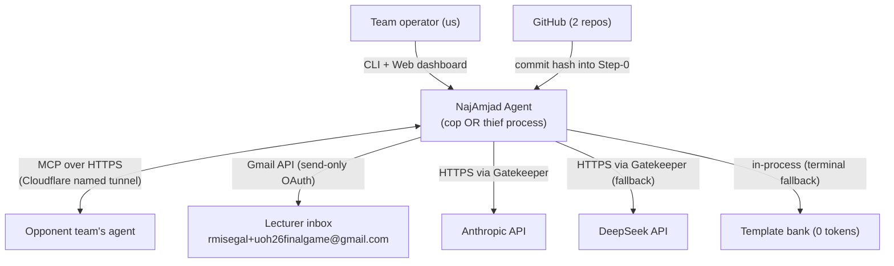
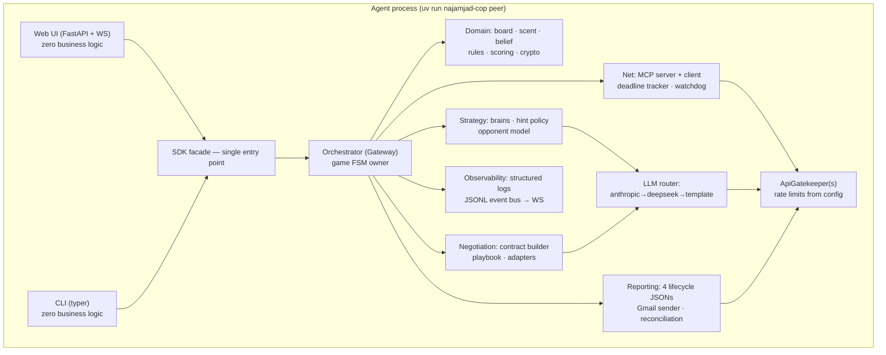
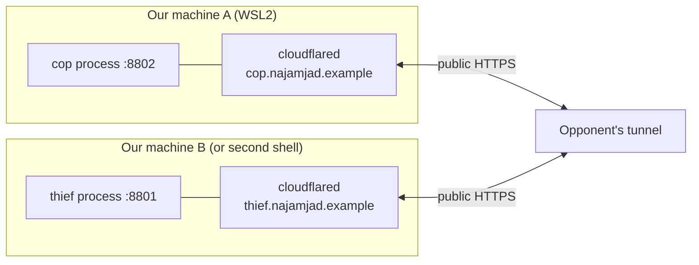
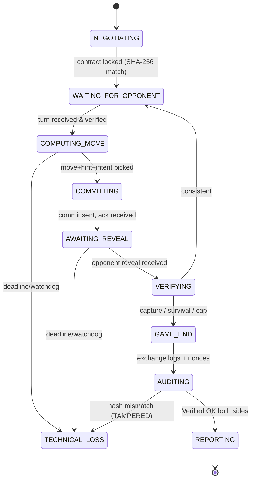
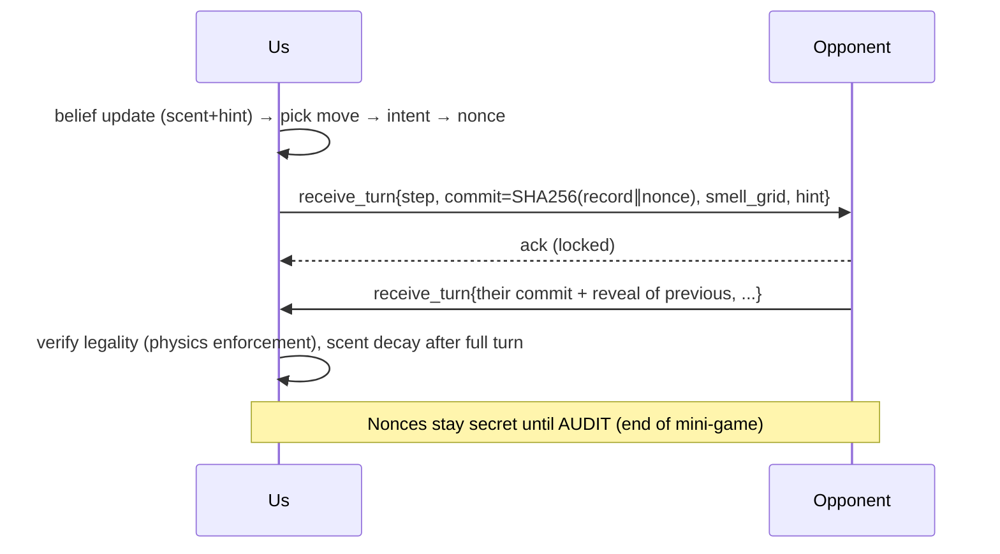
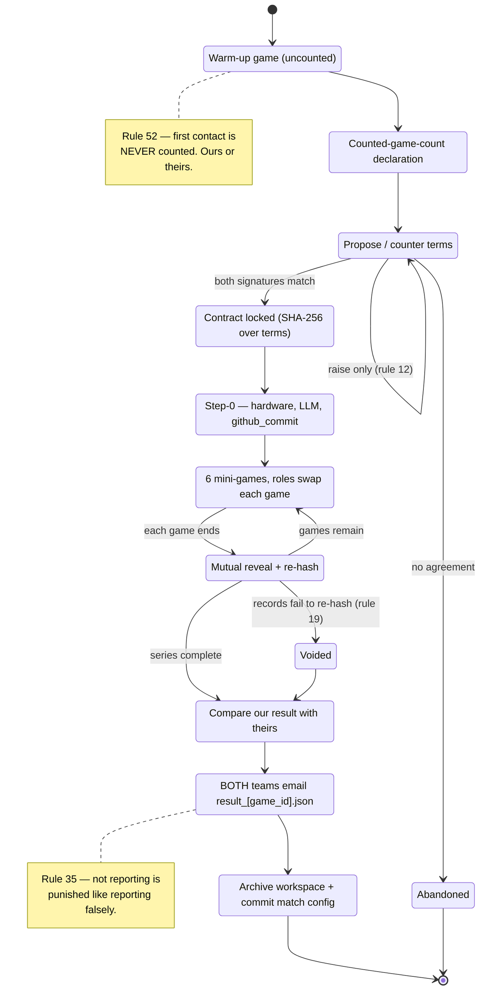

# PLAN — Architecture & Technical Plan (Team NajAmjad)

| | |
|---|---|
| **Document version** | 1.00 |
| **Date** | 2026-07-24 |
| **Companion docs** | `docs/PRD.md` (requirements), `docs/TODO.md` (tasks), `docs/research/*` (digests) |
| **Deliverable repos** | `najamjad-cop` (police agent) · `najamjad-thief` (thief agent) |

---

## 1. Architecture overview

> Every Mermaid block below is also exported to `assets/` as a PNG for printing
> and for the report, by `uv run python scripts/export_diagrams.py`. The blocks
> are the source of truth; the images are derived — editing an exported image
> instead of the block it came from puts a diagram in the report that no longer
> describes the system.

### 1.1 C4 Level 1 — System context



Two independent deployments of the same architecture: the cop process (from `najamjad-cop`) and
the thief process (from `najamjad-thief`). They never share memory, files, or config dirs
(book rules 1–2). During self-play testing, both run locally against each other over MCP.

### 1.2 C4 Level 2 — Containers (one agent process)



Orchestrator pattern is book-mandated (rule 3): peripheral modules never call each other
directly; the Orchestrator is the single conductor. SDK-facade and Gatekeeper are
guidelines-mandated.

### 1.3 C4 Level 3 — Component/package map with file-size budgets

The gateway is the whole point of this level: **peripheral packages never call each
other**. Strategy cannot reach the transport, the transport cannot reach the rules, and
the belief engine knows about neither. Every arrow below passes through the orchestrator,
which is what makes each package testable against a fake (book rule 3).

```mermaid
graph TB
    ORCH["orchestrator.py<br/><i>the only conductor</i>"]

    subgraph domain["domain/ — the rules"]
        FSM["fsm.py<br/>legal transitions"]
        BEL["belief.py · scent.py<br/>hint_evidence.py"]
        CRY["crypto.py · audit.py<br/>commit-reveal"]
        BRD["board.py · movement.py<br/>capture.py · scoring.py"]
    end

    subgraph strategy["strategy/ — the policy"]
        COP["cop_brain.py<br/>cop_barriers.py"]
        THF["thief_brain.py<br/>thief_escape.py"]
        HNT["hint_policy.py<br/>opponent_model.py"]
    end

    subgraph edge["the outside world"]
        NET["net/ — MCP client + server<br/>deadlines, rate limits"]
        LLM["llm/ — router, speaker<br/>guards, token meter"]
        REP["reporting/ — Gmail<br/>artifacts, archive"]
        UI["ui/ — dashboard<br/><i>read-only</i>"]
    end

    ORCH --> FSM
    ORCH --> BEL
    ORCH --> CRY
    ORCH --> BRD
    ORCH --> COP
    ORCH --> THF
    ORCH --> HNT
    ORCH --> NET
    ORCH --> LLM
    ORCH --> REP
    ORCH -. "events only" .-> UI

    classDef gate fill:#1f4e79,color:#fff,stroke:#0d2b44,stroke-width:2px
    class ORCH gate
```



Design budget: **≤ 120 code lines per file** (hard course cap 150). CI fails at > 150
and warns at > 120, so the tree below is *measured*, not planned — the number after
each module is its current code-line count, and the summary is the first line of its
own docstring. Regenerating it from the source is deliberate: the previous version of
this tree was a plan written before the code, and sixty-six modules had appeared under
it without ever being listed, including three that a match-day failure was later traced
through.

```
src/najamjad_agent/
├── cli.py                     # The command line: argument parsing, one SDK call, an exit  129
├── constants.py               # Project-wide immutable enumerations and physical constants  38
├── analysis/
│   ├── charts.py                  # Figures for the analysis notebook (T-2215, T-2216, T-2219,  95
│   ├── costs.py                   # The token-cost table and the savings analysis (T-2220, T-2  78
│   ├── datasets.py                # Typed readers for the measurement files the notebook plots  69
├── domain/
│   ├── audit.py                   # End-of-game mutual audit                                    67
│   ├── belief.py                  # Bayesian belief over the opponent's position                79
│   ├── board.py                   # The playing grid: bounds, neighbours, distance, and barrie  43
│   ├── capture.py                 # Capture rules and the thief's cryptographically-enforced t  35
│   ├── crypto.py                  # Commit-reveal sealing over SHA-256                          57
│   ├── endings.py                 # Deciding when a mini-game is over                           57
│   ├── fsm.py                     # The game state machine                                      73
│   ├── game_state.py              # Mutable per-mini-game state, owned exclusively by the orch  74
│   ├── handshake_retry.py         # Agreeing terms before a mini-game, retrying the same one o  21
│   ├── hint_evidence.py           # Turning an opponent's words into evidence                   80
│   ├── ledger.py                  # The per-mini-game commit ledger enforcing the four-step re  61
│   ├── match.py                   # Driving a whole match: six mini-games, alternating roles,  123
│   ├── match_audit.py             # The end-of-game reveal exchange (book rules 18-20)          49
│   ├── match_record.py            # What one mini-game leaves behind                            61
│   ├── match_resolution.py        # Scoring a mini-game that never produced a played result     16
│   ├── movement.py                # Move application, legality filtering, the Barrier Law, and  66
│   ├── nonce_vault.py             # Custody of nonces until the audit phase opens               50
│   ├── orchestrator.py            # The Orchestrator                                           143
│   ├── params.py                  # Immutable value object holding the negotiated, signed game  60
│   ├── ports.py                   # The interfaces the orchestrator conducts                    35
│   ├── scent.py                   # Scent field state: what one peer knows about the opponent'  82
│   ├── scent_models.py            # Pheromone emission and decay math, as a *negotiated* model  63
│   ├── scoring.py                 # Scoring: the fixed Appendix F table, plus series aggregati  53
│   ├── series.py                  # Series bookkeeping: 6 mini-games against one opponent, wit  63
│   ├── turn_ingress.py            # Absorbing the opponent's turn                              122
│   ├── turn_loop.py               # Alternating with the peer until someone's move ends the mi  15
├── llm/
│   ├── anthropic_provider.py      # Anthropic backend                                           73
│   ├── base.py                    # The provider contract every LLM backend satisfies           48
│   ├── deepseek_provider.py       # DeepSeek backend                                            85
│   ├── hint_guard.py              # The last check before a hint leaves us                      52
│   ├── hint_parser.py             # Decoding what the opponent said                             77
│   ├── injection_guard.py         # Treating the opponent's words as hostile input, because th  50
│   ├── prompts.py                 # Prompt builders                                             68
│   ├── router.py                  # The provider chain: Anthropic → DeepSeek → template (ADR-0 115
│   ├── speaker.py                 # The Speaker                                                 68
│   ├── template_provider.py       # The offline sentence bank                                   70
│   ├── token_meter.py             # Token metering                                             103
│   ├── warm_up.py                 # Pay the vendor's cold-start cost before the series, not du  17
├── negotiation/
│   ├── adapters.py                # Per-opponent quirk profiles                                 45
│   ├── contract.py                # The signed contract                                         73
│   ├── counted_games.py           # The counted-match tracker                                   69
│   ├── flow.py                    # The negotiation state machine                               89
│   ├── handshake.py               # The pre-game agreement exchange (T-2307)                    40
│   ├── identity.py                # Our group identity, in the shape the opponent's declaratio  22
│   ├── playbook.py                # Our negotiating position: what we open with, want, and wil  75
│   ├── terms.py                   # The signed terms, in the shape every other team will send   54
├── net/
│   ├── deadline.py                # Deadline tracking                                           67
│   ├── inbox.py                   # Thread-safe inboxes between the MCP server thread and the  115
│   ├── liveness.py                # Is anyone actually reachable?                               35
│   ├── match_gate.py              # One match at a time                                         24
│   ├── mcp_client.py              # Persistent MCP client for calling the opponent's tools      91
│   ├── mcp_probe.py               # Is the opponent's MCP server actually up?                   43
│   ├── mcp_server.py              # Our FastMCP server                                          76
│   ├── mcp_session.py             # Holding one MCP session open to the opponent                69
│   ├── opponent_wait.py           # Waiting for the opponent to come up before we start playin  60
│   ├── peer_transport.py          # The production Transport: our inboxes in, the opponent's s  50
│   ├── preflight.py               # Preflight                                                   67
│   ├── preflight_checks.py        # The standard match-day checklist                            78
│   ├── preflight_opponent.py      # Does the opponent expose a surface we can actually play ag  21
│   ├── session_guard.py           # Who is allowed to move in our game                          60
│   ├── sub_game_boundary.py       # Clearing the inbox between mini-games, without losing the   25
│   ├── tunnel.py                  # Public exposure via a tunnel with a **permanent** hostname  95
│   ├── watchdog.py                # Watchdog                                                    70
├── protocol/
│   ├── canonical.py               # Canonical JSON                                               7
│   ├── egress.py                  # The egress gate                                             52
│   ├── ingress.py                 # Parsing untrusted peer messages into a verdict              31
│   ├── schemas_artifacts.py       # Schemas for the four lifecycle artifacts the lecturer rece  74
│   ├── schemas_report.py          # The result artifact                                         58
│   ├── schemas_wire.py            # Wire schemas for MCP messages                               56
├── replay/
│   ├── __main__.py                # Open the replay viewer on a log file                        41
│   ├── app.py                     # The replay viewer as a second page on the FastAPI stack (A  36
│   ├── loader.py                  # Loading logs                                                55
│   ├── rebuild.py                 # Rebuilding the board at each step from the revealed record  71
│   ├── session.py                 # The loaded log a viewer is currently looking at             40
│   ├── verifier.py                # Re-verification of a log, step by step (book rule 20)       56
├── reporting/
│   ├── agreement.py               # The mutual-agreement hash                                   53
│   ├── archive.py                 # Bundle a finished match into one file worth keeping         54
│   ├── artifacts.py               # Writing the four lifecycle artifacts the lecturer receives 103
│   ├── filing.py                  # Turning a finished match into the four artifacts and the e 119
│   ├── gmail_auth.py              # Loading Gmail credentials, non-interactively or not at all  36
│   ├── gmail_sender.py            # Sending the result report                                   87
│   ├── mail_message.py            # Building the report email                                   25
│   ├── reconcile.py               # Agreeing the result with the opponent *before* anybody ema  82
│   ├── resilient_filing.py        # Writing what we can, when one artifact cannot be written    26
│   ├── result_blocks.py           # What the result report *says*                              109
│   ├── step_zero.py               # Step-0: the signed declaration that opens every mini-game   43
├── sdk/
│   ├── actions.py                 # Everything a consumer can ask the agent to *do*            117
│   ├── app_paths.py               # Where the dashboard looks for past matches                  18
│   ├── bootstrap.py               # The composition root: build a wired SDK from configuration 125
│   ├── handshake_setup.py         # Building the pre-game agreement exchange                    38
│   ├── llm_setup.py               # Building the hint writer: which models speak, and what the  71
│   ├── match_filing.py            # Turning a finished series into its artifacts, wired to rea  68
│   ├── match_history.py           # Past matches, read back from the artifacts they produced    69
│   ├── match_setup.py             # Assembling a playable match from configuration             118
│   ├── plugins.py                 # Loading a replacement component named in configuration (T-  23
│   ├── queries.py                 # Read models for the dashboard                               90
│   ├── sdk.py                     # The SDK                                                    143
├── shared/
│   ├── app_config.py              # App-level settings                                          24
│   ├── config.py                  # Configuration: private TOML underneath, signed JSON on top  70
│   ├── environment.py             # Loading `.env`, so a key written there is a key the agent   13
│   ├── events.py                  # The event bus                                               85
│   ├── gatekeeper.py              # The API gatekeeper                                         101
│   ├── logging_setup.py           # Applying `config/logging_config.json` at startup (guidelin  27
│   ├── opponents.py               # One file per opponent                                       31
│   ├── practice.py                # Practice mode                                               71
│   ├── rate_limits.py             # Rate-limit configuration, loaded from file                  46
│   ├── sysinfo.py                 # Machine specification for the Step-0 computational-fairnes  94
│   ├── version.py                 # Central code-version marker and config compatibility contr   2
│   ├── workspace.py               # Per-opponent match folders                                  26
├── strategy/
│   ├── base.py                    # Shared strategy scaffolding for both brains                 57
│   ├── cop_barriers.py            # Barrier planning                                            54
│   ├── cop_brain.py               # The cop's move policy                                       96
│   ├── hint_policy.py             # When to lie                                                 67
│   ├── opponent_model.py          # What we learn about one opponent                            68
│   ├── thief_brain.py             # The thief's move policy                                     82
│   ├── thief_escape.py            # Measuring how trapped a cell is                             37
├── ui/
│   ├── app.py                     # The dashboard server                                        61
│   ├── controls.py                # The few actions a dashboard is allowed to take (T-1820, T-  61
│   ├── frames.py                  # The WebSocket frame contract                                60
│   ├── server.py                  # Serving the dashboard alongside a live match                31
│   ├── views.py                   # Route handlers                                              86
```

Same tree in both repos; the packages differ in: brain modules included, default configs
(`config/police/` vs `config/thief/`), README, and role-specific docs. See ADR-002.

### 1.4 Deployment diagram



---

## 2. Key state machines & sequences (UML)

### 2.1 Game FSM (book rules 4–5 — illegal transitions raise)



### 2.2 Turn sequence (commit-reveal, per move)



### 2.3 Match lifecycle



Warm-up (uncounted) → counted-game-count declarations → negotiation → contract lock →
Step-0 (hardware+LLM+commit hash, signed) → 6 mini-games with role swaps → mutual audit per
mini-game → result reconciliation → both teams email `result_<game_id>.json` separately →
archive workspace + commit match config.

---

## 3. Architecture Decision Records

### ADR-001 — MCP/FastMCP transport *(status: imposed)*
Book-mandated, non-replaceable. Interop tool surface mirrors the reference simulator
(`negotiate`, `receive_turn`, `submit_audit`, `receive_control`) because every league team
starts from that repo — maximum compatibility for minimum negotiation cost.

### ADR-002 — Two self-contained repos, mirrored core, no shared runtime *(status: accepted)*
**Context:** submission requires separate cop and thief repos; runtime state sharing
disqualifies. **Decision:** both repos contain the full `najamjad_agent` package; role
differences live in strategy modules and `config/` defaults. A `scripts/core_manifest.py`
checksum manifest + CI job asserts the mirrored core files stay byte-identical across repos
(controlled duplication, not drift). **Alternatives:** shared third package (submission
friction, grader ambiguity), git submodule (fragile for graders), true fork (guaranteed
drift). **Trade-off:** duplication cost accepted for grader-friendly standalone repos.

### ADR-003 — LLM provider chain Anthropic → DeepSeek → template *(status: accepted)*
User requirement. Anthropic for best negotiation/bluff quality; DeepSeek (OpenAI-compatible,
cheap, stable) for testing and as fallback; template bank as terminal 0-token floor (book
default). Health-based degradation and recovery; **active provider always visible** (log
event + UI badge + per-message provenance). LLM never selects moves (book rule 25).

### ADR-004 — Cloudflare named tunnel for public exposure *(status: accepted)*
Permanent hostname fixes A6's URL churn. Requires a domain on a (free) Cloudflare zone —
operator prerequisite. `tunnel.py` supervises cloudflared, and preflight performs a self-call
through the public URL. **Fallback:** ngrok static domain (config switch, no code change).

### ADR-005 — FastAPI + WebSocket dashboard; UI is logic-free *(status: accepted)*
Push-based updates from the event bus (no polling — A6 clunkiness), single-page dashboard;
strictly local-truth rendering (book rules 8–9); all data via SDK queries. Replay viewer as a
second page over the same stack; screenshots for README come from these two pages.

### ADR-006 — pydantic schema gates on every ingress AND egress *(status: accepted)*
All wire messages, lifecycle artifacts, and the result email are validated against strict
models (required booleans non-nullable) — egress failure blocks the send and alerts the
operator. Ingress is tolerant: unknown fields logged and ignored; malformed input → structured
error, never a crash. Directly kills A6 pains #5/#6.

### ADR-007 — Heuristic/expectimax strategy; no RL *(status: accepted)*
RL is explicitly optional and untaught; 19 days favor a strong deterministic policy stack:
Bayesian belief + expectimax with barrier planning (cop) / survival-horizon maximization
(thief) + credibility-managed hint policy. The strategy lab (self-play sweeps) supplies the
guidelines-required sensitivity analysis instead of learning curves.

### ADR-008 — Event-sourced observability *(status: accepted)*
Single append-only JSONL event stream per match (correlation ids: `game_uid`, step) is the
one source of truth consumed by: WS dashboard, structured log files, post-match analysis
notebook, and the archive bundle. `dictConfig` applied at startup (A6: config existed but was
never wired). No silent `except` — enforced by ruff (S110/S112 via extend-select in our own
stricter local profile) and code review.

### ADR-009 — One ApiGatekeeper class, per-service instances *(status: accepted)*
Guidelines require ALL external calls gated; book requires token-bucket + DOS detector for
Gmail. One `ApiGatekeeper` (FIFO queue, config-driven limits, backpressure, drain, full call
logging) instantiated per service: `mcp_peer`, `anthropic`, `deepseek`, `gmail`. Limits in
`config/rate_limits.json` (version 1.00): gmail 30 rpm / 2 concurrent / backoff 5 s / 3
retries / queue 100 (Appendix F minimums).

**Coverage-omit note:** the guidelines' sample coverage config omits `src/main.py` and
`src/**/gui/*`; we deliberately omit **less** (only the entry point and `ui/static` assets) —
our `ui/` route/view code stays covered. Stricter than the sample, documented here for graders.

### ADR-010 — uv + ruff + pytest toolchain, CI as compliance robot *(status: imposed/accepted)*
Guidelines-prescribed ruff config; uv-only. GitHub Actions on both repos run: ruff, pytest
with `--cov` (`fail_under = 85`, team target 90), file-size gate (code lines ≤ 150 hard /
120 warn), secret scan, core-manifest cross-repo check, uv-only grep gate (no pip/python -m).

### ADR-011 — Negotiation playbook + adapter profiles *(status: accepted)*
Negotiables (board size↑, starts, axis, map area, hint word cap, timeouts, token budget) get
a prepared position: default / preferred / red line, encoded in `playbook.py` and rendered to
free-language proposals by the LLM (human-approved before send). Per-opponent quirks
(naming, tolerances, pacing) live in `adapters.py` profiles selected at handshake — adapting
to a new team is configuration, not code (A6 pain #2).

### ADR-012 — Golden-file interop tests against the reference simulator *(status: accepted)*
The simulator's artifacts and sample-run outputs are checked into `tests/goldens/`. CI
validates our schemas parse them and our artifacts round-trip to the same shapes. A weekly
(and pre-match) smoke: full series vs the unmodified reference simulator over localhost — our
definitive interop regression (A6 pain #6).

### ADR-013 — No email *receive* path; agreement lives on MCP *(status: accepted)*
**Context:** Assignment 6's worst failure was the inbound-email flow (silent, unobservable,
OAuth-blocked). **Decision:** we never receive email. The book scopes email to send-only
result reporting (`gmail.send`, rule 30); result *agreement* happens over MCP via the
reconciliation exchange (FR-REP-6) **before** either side emails the lecturer. The entire
failed-inbound-email class from A6 is designed out rather than fixed. **Trade-off:** none —
receiving mail has no role in the book's protocol.

### ADR-014 — Static type checking beyond the guidelines *(status: accepted)*
A6 retrospective lesson 10: no type checker meant integration-seam bugs surfaced in the
field. Guidelines mandate only ruff; we additionally run `pyright` (basic mode) in CI on both
repos as a local, stricter, non-graded gate. Full type hints on all public interfaces.

### ADR-015 — One match at a time, refused retriably *(status: accepted, 2026-08-02)*
`negotiate` accepted a handshake at any moment, including mid-mini-game. ahk-yosi's peer
runs on Cloud Run and retried our cop endpoint on a loop while we dialled their thief:
**58 inbound negotiates** in one six-game series, two games sharing one game state, five
sub-games scored `timeout`, and a 0-0 void for both teams.

`net/match_gate.py` closes the gate from `Inboxes.begin_sub_game()` until
`PeerTransport.finish_sub_game()`, which `MatchRunner.play_series` calls from a `finally`
so a crash cannot leave it shut. Two properties are load-bearing:

* **the refusal is retriable, never fatal.** The peer is told to re-send at the boundary,
  and *their retry is the mechanism* that resynchronises two drifted clocks. A fatal
  refusal would turn a recoverable desync into a forfeit;
* **the gate is open by default**, so an idle listening agent can still be challenged.

Rejected: serialising on a lock (a blocked handshake burns the opponent's deadline) and
per-game inboxes (the drift is between the two agents' clocks, not inside our queues).

### ADR-016 — No single artifact may suppress the others *(status: accepted, 2026-08-02)*
The filer wrote straight through — declaration, then a config and a log per mini-game, then
the result — and `write_result` is *last*, so the one artifact that is emailed and graded
was the most likely to be lost. Against uoh-sqak a schema refusal on the first log
(`records` had `min_length=1`; an abandoned game genuinely has none) aborted the whole run
and filed **zero** artifacts for a six-game series.

Book rule 35 scores a missing report as not having played, which is strictly worse than
losing, so a partial report that names its own gaps beats a clean failure.
`reporting/resilient_filing.py` makes each write independent: `attempt()` records a failure
as `artifact.skipped` and continues, `missing()` names the gaps in `artifacts.incomplete`.

### ADR-017 — A hung mini-game is scored as played *(status: accepted, 2026-08-02)*
`subgame.abandoned` routed to the unplayed path, which hardcodes `steps: 0` and the words
"handshake failed — never played". uoh-sqak held 27 of our sealed turns in g01 and 11 each
in g03 and g05, and reported it against their own interest.

Rules 33-35 void *both* teams' reports when they contradict, so the mislabel cost more than
the games. `domain/match_resolution.py` holds both shapes side by side and scores an
abandoned game `TIMEOUT` — the verdict the opponent's own watchdog reaches when we go
silent — so the two ledgers describe one event the same way.

### ADR-018 — Diagnostic detail belongs in the event, not in a type name *(status: accepted, 2026-08-03)*
`gatekeeper.retry` recorded `type(error).__name__`, and `PeerSession.drop` wrapped teardown
in `contextlib.suppress`. fastmcp wraps **every** connect-level fault as a bare
`RuntimeError`, so three lost police mini-games produced thirty identical `RuntimeError`
lines that distinguished nothing, and a day went into experiments the log should have
answered.

Every gatekeeper and session event now carries the exception's message (truncated to 200
characters, so a tunnel's HTML error page cannot flood what it is meant to clarify) and the
asyncio task name. `drop()` reports `client.drop_failed` and *then* discards. The rule
generalises: a caught exception that is not re-raised must leave its message somewhere a
person will read.

---

## 4. Interop & negotiation playbook (summary; full doc `docs/PRD_negotiation.md` at build time)

1. **Contact** (out-of-band, e.g. course forum/WhatsApp): exchange public MCP URLs + proposed
   match window; send our one-page "How to play us" README link (lowers opponent friction).
2. **Warm-up game** (uncounted, encouraged by book): verifies interop before anything counts.
3. **Negotiation session** over MCP `negotiate`: playbook-driven proposals in free language;
   every step persisted to the timeline; outcome = canonical `game.json` + SHA-256 exchange +
   pheromone-model lock + counted-game declarations.
4. **Contract freeze**: byte-identical `config_<game_id>_gNN.json` committed to repos.
5. **Play → audit → reconcile → both report** (each side separately, attachment JSON).

Red lines (never accept): lowering any Appendix F minimum; numeric-coordinate hint protocols;
LLM-move exception (we decline — our edge is deterministic strategy); skipping audit.

---

## 5. Testing strategy (TDD, target ≥ 90%)

| Layer | Approach |
|---|---|
| Domain (board/scent/belief/crypto/scoring/fsm) | Pure unit tests + **hypothesis property tests** (e.g., commit-reveal round-trip ∀ records; scent decay invariants: clamp bounds, monotone decay; FSM: illegal transitions always raise) |
| Protocol schemas | Golden files from reference simulator (`tests/goldens/`); negative tests (nulls where booleans required must fail egress) |
| Strategy | Deterministic scenario tests (seeded); regression suites of tactical positions ("cop must cut corridor here"); self-play statistical gates (win-rate vs reference brain ≥ 70% over 100 seeded games — nightly job, not PR-blocking) |
| Net/MCP | In-process FastMCP client-server tests; fault injection: timeouts, malformed payloads, dropped connections, out-of-order turns |
| LLM router | Providers mocked (no external services in tests — guideline rule 7); chain degradation/recovery paths; token budget stop; hint guard (word cap, coordinate leak) |
| Reporting | Gmail API mocked; egress gate blocks invalid payloads; reconciliation diff cases; artifact filename/`game_uid` consistency |
| Integration | Two-process localhost series (cop repo vs thief repo binaries) in CI: full 6 mini-games + audit + artifacts, asserting "Verified OK" |
| Compliance meta-tests | File-size gate test, no-silent-except grep gate, secret scan, uv-only gate, cross-repo core manifest |

Structure: `tests/unit/` mirrors `src/`; `tests/integration/`; shared `conftest.py` fixtures;
every public function ≥ 1 test; happy + error paths; test files also ≤ 150 code lines.

---

## 6. Observability plan

- **Event bus** (ADR-008): every state transition, MCP call (in/out), LLM call (provider,
  model, tokens, latency, fallback reason), gatekeeper queue event, email send (message id),
  negotiation step, audit verdict → JSONL + WS.
- **Dashboard panels**: FSM state, turn banner, belief heatmap, dialogue transcript (with
  provider provenance per message), negotiation timeline, gatekeeper queues, token meter vs
  budget, email status, incident feed, active-provider badge, tunnel health.
- **Match archive**: `archive` CLI verb bundles events, logs, artifacts, config, screenshots
  into `matches/<opponent>/` — the raw material for the analysis notebook and the README.

## 7. Security plan

Zero-trust ingress validation; nonce vault (in-memory + encrypted spill, never logged/shown);
`secrets.compare_digest` everywhere; Gmail scope `gmail.send` only; OAuth artifacts
(`credentials.json`, `token.json`) gitignored in both repos + secret-scan CI; DOS detector on
outbound mail; no `shell=True`; deps pinned via `uv.lock`; per-match commit hash recorded
(supply-chain traceability for the grader).

## 8. Cost & token plan

Template mode default for in-game banter (0 tokens); LLM spent where it wins games:
negotiation prose (Sonnet-class), hint generation every N steps (Haiku-class), hint parsing
(Haiku-class or deterministic parser). Router enforces per-series budget with early warning at
70%. Token-cost table (input/output split per model per purpose) auto-generated from
TokenMeter data into the notebook — satisfies guidelines §11 with real measured numbers.

## 9. Risk register

| # | Risk | P | I | Mitigation / trigger |
|---|---|---|---|---|
| R1 | No opponents available early | M | H | Book: warm-ups allowed; recruit opponents by Aug 3; we offer "easy to play us" pack; reference simulator as rehearsal opponent |
| R2 | Opponent implementation quirks break games | H | H | Warm-up mandatory before counted; adapter profiles; tolerant ingress; never count first contact |
| R3 | Contradictory result reports (rule 35: both get 0) | M | H | Reconciliation diff before send; shared artifact hashes in both reports |
| R4 | Cloudflare domain not available in time | M | M | Decide by Jul 27; fallback ngrok static domain (config-only switch) |
| R5 | Anthropic key/billing issues (seen today) | M | M | DeepSeek fallback tested first-class; template floor; preflight provider health check |
| R6 | 150-line breaches during crunch | M | M | 120-line design budget; CI hard gate; split strategies from guidelines §3.2 |
| R7 | Coverage gaming temptation on integration seams | M | M | Policy: only `ui/static` and `main` excluded; integration seams tested via in-process fakes |
| R8 | WSL2 networking oddities (tunnel, ports) | M | M | Early M3 spike; documented runbook; second machine as backup host |
| R9 | Schedule slip into league window | M | H | League matches start with warm-ups Aug 5 regardless of polish; UI luxuries deferred after M5 |
| R10 | Gmail account restrictions (A6: account banned) | L | H | Health-check the existing OAuth client first (PRD A5); create a fresh dedicated Google Cloud project if tainted; send-only scope; token-bucket + DOS detector; drafts in dev |
| R11 | LLM API keys/billing not ready (billing failure observed 2026-07-24) | M | M | Explicit M1 task: procure + billing-verify Anthropic and DeepSeek keys with a live smoke call through the gatekeeper; template floor if both fail |

## 10. Delivery timeline

Mirrors PRD §7 milestones M0–M7. Build order follows the book's recommended 7-stage plan
(base logic → local MCP → strategy → language+scent → tunneling → crypto → reporting+GUI),
compressed: stages overlap because the walking skeleton (M1) stands up all CI gates first,
and crypto is built with the turn loop (M3) rather than after it — retrofit of commit-reveal
was judged higher-risk than co-development.

### 10.1 Capacity & descope ladder

~569 build tasks in ~12 build days is ≈ 47 tasks/day — feasible only because tasks are
deliberately small (impl+test pairs) and executed by AI agents orchestrated by the team, with
epics E05–E17 parallelizable across agent sessions. To protect the critical path, descope in
this order if behind schedule at any milestone gate (each rung sacrificed keeps every
book/guidelines MUST intact):

1. P2 tasks everywhere (stretch capabilities: strategy lab sweeps beyond the required
   sensitivity study, cockpit luxuries, extra dashboard panels).
2. E14/E15 advanced tactics (drop to expectimax depth 1 + reference-grade heuristics; keep the
   legality filter and belief engine).
3. E18 dashboard reduced to the mandatory screens (belief heatmap, turn banner, replay,
   email/report status) — WebSocket core kept, cosmetic panels cut.
4. Opponent-model persistence across series (E16 tail) — in-series modeling kept.
5. Counted-match target drops 6 → 4 → 2 (2 is the pass-grade floor; never below).

**Never descoped:** anything mapped to the 55 binding rules, guidelines master checklist,
the four lifecycle artifacts, commit-reveal/audit, reporting, or the two counted matches.

## 11. Per-mechanism PRDs to author during build (guidelines §2.3)

`PRD_belief_engine.md` · `PRD_commit_reveal.md` · `PRD_negotiation.md` · `PRD_llm_router.md` ·
`PRD_strategy_cop.md` · `PRD_strategy_thief.md` · `PRD_gatekeeper.md` · `PRD_reporting.md` —
each: theory, I/O contracts, metrics, alternatives, test scenarios.
